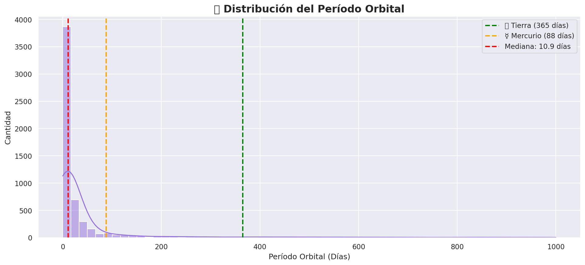
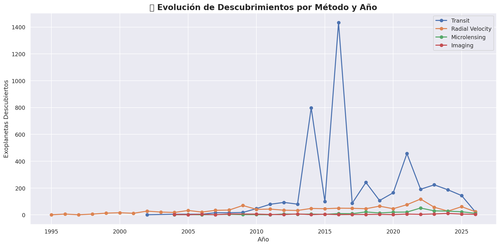
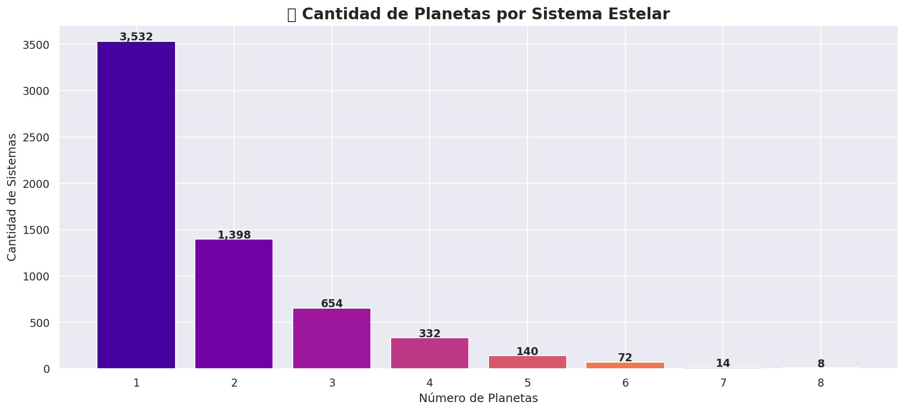
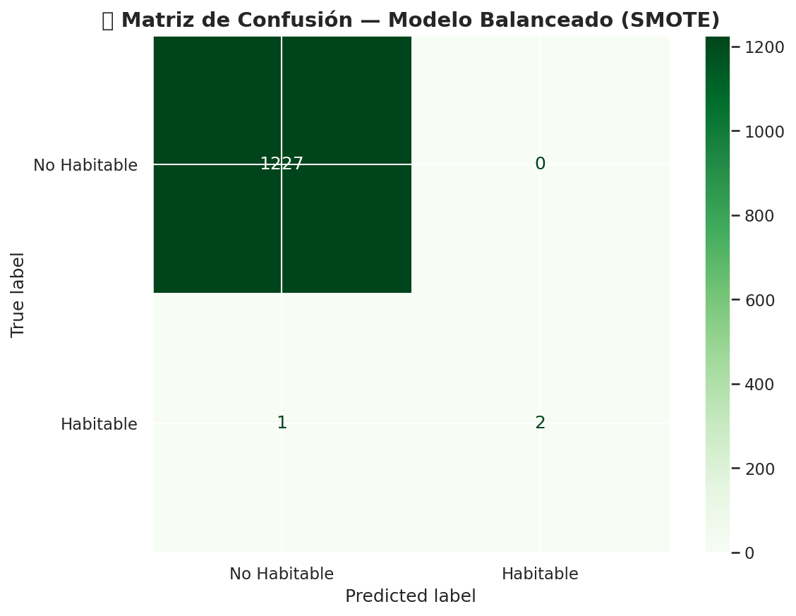

# 🪐 Análisis de Exoplanetas — NASA Exoplanet Archive


---

## 📌 Descripción

Este proyecto analiza el catálogo completo de exoplanetas
descubiertos hasta la fecha, utilizando datos oficiales de la
**NASA Exoplanet Archive**. A través de exploración, limpieza,
visualización y Machine Learning, se identifican patrones en
las características de estos mundos distantes y se construye
un modelo capaz de clasificar qué planetas podrían tener
condiciones similares a la Tierra.

> *"De miles de mundos conocidos, ¿cuántos podrían albergar vida?"*

---

## 🎯 Objetivos

- Explorar y limpiar datos reales de astronomía
- Identificar patrones en tamaño, temperatura y órbita
- Construir un índice de similitud terrestre propio
- Entrenar un modelo de clasificación de habitabilidad
- Comunicar hallazgos de forma clara y visual

---

## ❓ Preguntas que responde este análisis

1. ¿Cuántos exoplanetas se han descubierto y cómo ha
   evolucionado ese número en el tiempo?
2. ¿Qué métodos de detección han sido más efectivos?
3. ¿Qué tan grandes y calientes son comparados con la Tierra?
4. ¿Cuáles tienen condiciones potencial?

## 📊 Visualizaciones principales

| Gráfico | Descripción |
|--------|-------------|
|  | Métodos de detección más usados |
|  | Distribución de tamaños |
|  | Distribución de períodos orbitales |
|  | Descubrimientos por año y método |
|  | Temperatura estelar vs radio |
|  | Planetas por sistema estelar |
|  | Top 10 candidatos habitables |
|  | Mapa de habitabilidad |
|  | Modelo ML — Matriz de confusión |

## 🤖 Machine Learning

Se entrenó un clasificador **Random Forest** para predecir
si un exoplaneta es potencialmente habitable o no.

### Resultados del modelo

| Métrica | Sin SMOTE | Con SMOTE |
|---------|-----------|-----------|
| Accuracy | 99.84% | 99.84% |
| Recall habitables | 0.33 | **0.67** |
| F1-score habitables | 0.50 | **0.80** |
| Macro avg F1 | 0.75 | **0.90** |

### Hallazgo clave
Menos del **0.24%** de los exoplanetas conocidos cumple
criterios mínimos de habitabilidad — lo que refleja la
excepcional rareza de mundos similares a la Tierra y
representa un desafío inherente para cualquier modelo
de clasificación.

---

## 🗂️ Estructura del proyecto
```
exoplanetas-nasa/
│
├── data/
│   ├── exoplanetas.csv              # Dataset original NASA
│   ├── exoplanetas_limpio.csv       # Dataset procesado
│   └── exoplanetas_habitables.csv   # Candidatos habitables
│
├── notebooks/
│   └── analisis_exoplanetas.ipynb   # Cuaderno principal
│
├── images/
│   └── (todas las visualizaciones exportadas)
│
├── README.md
└── requirements.txt
```

---

## 🛠️ Tecnologías utilizadas

- **Python 3.12**
- **Pandas** — manipulación de datos
- **Matplotlib / Seaborn** — visualización
- **Scikit-learn** — Machine Learning
- **Imbalanced-learn (SMOTE)** — balance de clases
- **Google Colab** — entorno de desarrollo
- **GitHub** — control de versiones

---

## ▶️ Cómo ejecutar el proyecto

1. Clona el repositorio:
```bash
git clone https://github.com/tu-usuario/exoplanetas-nasa.git
```

2. Instala las dependencias:
```bash
pip install -r requirements.txt
```

3. Abre el cuaderno en Google Colab o Jupyter:
```bash
jupyter notebook notebooks/analisis_exoplanetas.ipynb
```

4. Descarga el dataset desde:
   [NASA Exoplanet Archive](https://exoplanetarchive.ipac.caltech.edu)
   y colócalo en la carpeta `data/`

---

## 📋 requirements.txt
```
pandas
matplotlib
seaborn
scikit-learn
imbalanced-learn
jupyter
```

---

## 🔭 Fuente de datos

**NASA Exoplanet Archive**
Instituto de Tecnología de California — Jet Propulsion Laboratory
🔗 https://exoplanetarchive.ipac.caltech.edu

---

## 👤 Autor

**Jorge**
Estudiante — Oracle Next Education (ONE) — Alura LATAM
Especialización: Ciencia de Datos
📅 2026

---

## 📄 Licencia

Este proyecto es de uso educativo y libre distribución.
Los datos pertenecen a la NASA y están disponibles
públicamente bajo su política de datos abiertos.
